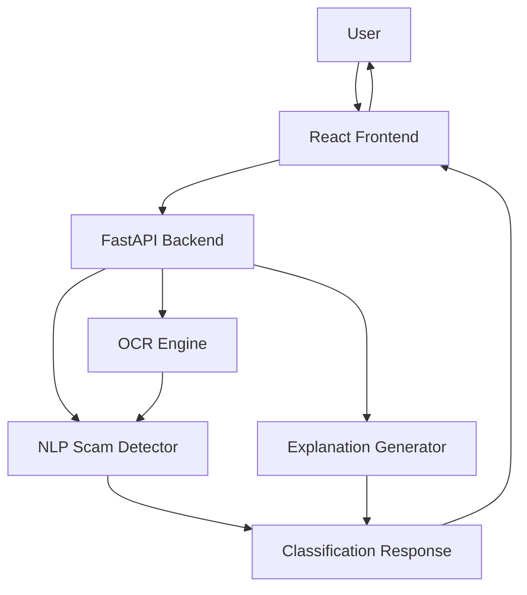
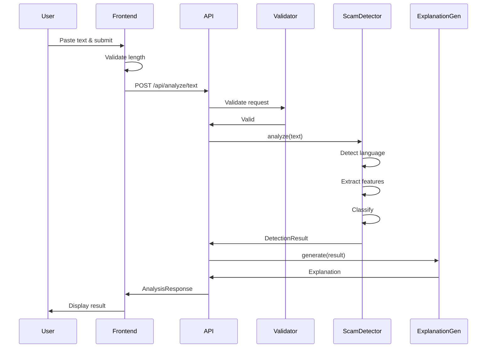
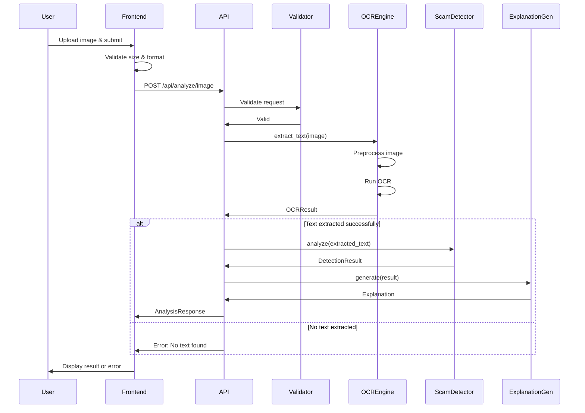

# Design Document - ScamShield AI

## Overview

ScamShield AI is a full-stack AI-powered application that detects scams in message content and screenshots. The system architecture consists of three main layers:

1. **Frontend Layer**: React-based web interface providing text input and image upload capabilities
2. **Backend Layer**: FastAPI-based REST API handling requests, orchestrating AI models, and managing responses
3. **AI/ML Layer**: NLP models for scam detection, OCR engine for text extraction, and LLM for explanation generation

The system is designed to be platform-independent, analyzing content from any messaging service (WhatsApp, SMS, Email, Instagram, Telegram) without relying on sender reputation or phone numbers.

## Architecture

### High-Level Architecture



### Component Architecture

The system follows a layered architecture pattern:

**Presentation Layer (Frontend)**
- React components for UI rendering
- Form handling for text input and file uploads
- Result display with visual indicators
- Responsive design for mobile and desktop

**Application Layer (Backend API)**
- Request validation and sanitization
- Content routing (text vs. image)
- AI model orchestration
- Response formatting
- Error handling and logging

**AI/ML Layer**
- NLP model for scam pattern detection
- OCR engine for text extraction from images
- LLM for generating human-readable explanations
- Language detection for multi-language support

**Data Layer (Optional)**
- Anonymized usage logs
- Performance metrics
- Model training data (future enhancement)

## Components and Interfaces

### Frontend Components

#### 1. InputForm Component
**Responsibility**: Capture user input (text or screenshot)

**Interface**:
```typescript
interface InputFormProps {
  onSubmit: (content: TextContent | ImageContent) => Promise<void>;
  isLoading: boolean;
}

type TextContent = {
  type: 'text';
  content: string;
};

type ImageContent = {
  type: 'image';
  file: File;
};
```

**Behavior**:
- Validates text length (max 5,000 characters)
- Validates image size (max 5 MB)
- Validates image format (JPEG, PNG, WebP)
- Displays validation errors inline
- Disables submit during processing

#### 2. ResultDisplay Component
**Responsibility**: Display analysis results with classification, confidence, and explanation

**Interface**:
```typescript
interface ResultDisplayProps {
  result: AnalysisResult;
}

interface AnalysisResult {
  classification: 'scam' | 'safe';
  confidence: number; // 0-100
  explanation: string;
  detectedLanguage?: string;
  scamIndicators?: string[];
}
```

**Behavior**:
- Shows color-coded classification (red for scam, green for safe)
- Displays confidence as percentage with visual bar
- Renders explanation with proper formatting
- Highlights detected scam indicators as badges

#### 3. ErrorDisplay Component
**Responsibility**: Display user-friendly error messages

**Interface**:
```typescript
interface ErrorDisplayProps {
  error: ErrorResponse;
  onRetry?: () => void;
}

interface ErrorResponse {
  code: string;
  message: string;
  details?: string;
}
```

### Backend API Endpoints

#### 1. POST /api/analyze/text
**Purpose**: Analyze text content for scam indicators

**Request**:
```json
{
  "content": "string (max 5000 chars)",
  "language": "string (optional: 'en' | 'hi' | 'mr' | 'auto')"
}
```

**Response** (200 OK):
```json
{
  "classification": "scam | safe",
  "confidence": 85,
  "explanation": "string",
  "detectedLanguage": "en",
  "scamIndicators": ["urgency", "fake_prize"],
  "processingTime": 1.2
}
```

**Error Responses**:
- 400: Invalid input (empty content, exceeds length)
- 413: Content too large
- 500: Internal server error
- 504: Processing timeout

#### 2. POST /api/analyze/image
**Purpose**: Extract text from image and analyze for scam indicators

**Request**: Multipart form data
- `file`: Image file (max 5 MB)
- `language`: Optional language hint

**Response** (200 OK):
```json
{
  "classification": "scam | safe",
  "confidence": 78,
  "explanation": "string",
  "extractedText": "string",
  "detectedLanguage": "hi",
  "scamIndicators": ["otp_request", "suspicious_link"],
  "processingTime": 2.5
}
```

**Error Responses**:
- 400: Invalid file format or no text extracted
- 413: File too large
- 500: Internal server error
- 504: Processing timeout

#### 3. GET /api/health
**Purpose**: Health check endpoint for monitoring

**Response** (200 OK):
```json
{
  "status": "healthy",
  "services": {
    "nlp": "operational",
    "ocr": "operational",
    "llm": "operational"
  },
  "uptime": 86400
}
```

### AI/ML Components

#### 1. ScamDetector (NLP Model)
**Responsibility**: Analyze text content and classify as scam or safe

**Interface**:
```python
class ScamDetector:
    def analyze(self, text: str, language: str = 'auto') -> DetectionResult:
        """
        Analyze text for scam indicators.
        
        Args:
            text: Input text to analyze
            language: Language code ('en', 'hi', 'mr', 'auto')
            
        Returns:
            DetectionResult with classification and confidence
        """
        pass

@dataclass
class DetectionResult:
    classification: Literal['scam', 'safe']
    confidence: float  # 0.0 to 1.0
    scam_indicators: List[str]
    detected_language: str
```

**Implementation Approach**:
- Use pre-trained multilingual transformer model (e.g., XLM-RoBERTa, mBERT)
- Fine-tune on scam/safe dataset in English, Hindi, and Marathi
- Extract features: urgency keywords, suspicious patterns, link presence, OTP mentions
- Output probability distribution over scam/safe classes
- Threshold: confidence > 0.7 for high-confidence classification

**Scam Indicators Detected**:
- `urgency`: Time-pressure tactics ("act now", "limited time")
- `fake_prize`: Prize/reward claims ("you won", "claim reward")
- `otp_request`: Requests for OTP or verification codes
- `suspicious_link`: Shortened URLs or suspicious domains
- `threat`: Threatening language ("account blocked", "legal action")
- `impersonation`: Claims to be from banks, government, or companies
- `personal_info_request`: Requests for passwords, card details, etc.

#### 2. OCREngine
**Responsibility**: Extract text from uploaded images

**Interface**:
```python
class OCREngine:
    def extract_text(self, image_bytes: bytes) -> OCRResult:
        """
        Extract text from image using OCR.
        
        Args:
            image_bytes: Image file as bytes
            
        Returns:
            OCRResult with extracted text and confidence
        """
        pass

@dataclass
class OCRResult:
    text: str
    confidence: float
    language: str
```

**Implementation Approach**:
- Use Tesseract OCR or cloud-based OCR (Google Vision API, AWS Textract)
- Support English, Hindi (Devanagari script), and Marathi
- Preprocess images: grayscale conversion, noise reduction, contrast enhancement
- Handle various image qualities and orientations
- Return empty text if confidence < 0.5

#### 3. ExplanationGenerator (LLM)
**Responsibility**: Generate human-readable explanations for classifications

**Interface**:
```python
class ExplanationGenerator:
    def generate(
        self, 
        text: str, 
        classification: str, 
        scam_indicators: List[str],
        language: str = 'en'
    ) -> str:
        """
        Generate explanation for classification.
        
        Args:
            text: Original analyzed text
            classification: 'scam' or 'safe'
            scam_indicators: List of detected indicators
            language: Target language for explanation
            
        Returns:
            Human-readable explanation string
        """
        pass
```

**Implementation Approach**:
- Use GPT-3.5/GPT-4 or open-source LLM (Llama, Mistral)
- Prompt engineering: Include classification, indicators, and text snippet
- Generate explanations in the same language as input (when possible)
- Keep explanations concise (2-4 sentences)
- Highlight specific scam tactics found in the message
- For safe messages, explain why no significant threats were detected

**Example Prompt Template**:
```
You are a scam detection expert. Analyze the following message and explain why it was classified as {classification}.

Message: "{text}"
Classification: {classification}
Confidence: {confidence}%
Detected Indicators: {scam_indicators}

Provide a clear, concise explanation in {language} that:
1. States whether the message is a scam or safe
2. Highlights specific red flags or safe indicators
3. Educates the user about scam tactics (if applicable)

Keep the explanation under 100 words and suitable for non-technical users.
```

## Data Models

### Request Models

```python
from pydantic import BaseModel, Field, validator
from typing import Literal, Optional

class TextAnalysisRequest(BaseModel):
    content: str = Field(..., min_length=1, max_length=5000)
    language: Optional[Literal['en', 'hi', 'mr', 'auto']] = 'auto'
    
    @validator('content')
    def content_not_empty(cls, v):
        if not v.strip():
            raise ValueError('Content cannot be empty or whitespace only')
        return v

class ImageAnalysisRequest(BaseModel):
    file: bytes = Field(..., max_length=5 * 1024 * 1024)  # 5 MB
    language: Optional[Literal['en', 'hi', 'mr', 'auto']] = 'auto'
```

### Response Models

```python
from pydantic import BaseModel, Field
from typing import List, Literal, Optional

class AnalysisResponse(BaseModel):
    classification: Literal['scam', 'safe']
    confidence: float = Field(..., ge=0, le=100)
    explanation: str
    detected_language: str
    scam_indicators: List[str] = []
    processing_time: float
    extracted_text: Optional[str] = None  # Only for image analysis

class ErrorResponse(BaseModel):
    code: str
    message: str
    details: Optional[str] = None

class HealthResponse(BaseModel):
    status: Literal['healthy', 'degraded', 'unhealthy']
    services: dict
    uptime: int
```

### Internal Models

```python
from dataclasses import dataclass
from typing import List, Literal

@dataclass
class DetectionResult:
    classification: Literal['scam', 'safe']
    confidence: float  # 0.0 to 1.0
    scam_indicators: List[str]
    detected_language: str

@dataclass
class OCRResult:
    text: str
    confidence: float
    language: str
```

## Data Flow

### Text Analysis Flow



### Image Analysis Flow



## Error Handling

### Error Categories

1. **Validation Errors** (400 Bad Request)
   - Empty content
   - Content exceeds length limit
   - Invalid file format
   - File size exceeds limit

2. **Processing Errors** (500 Internal Server Error)
   - OCR engine failure
   - NLP model failure
   - LLM generation failure
   - Database connection failure (if applicable)

3. **Timeout Errors** (504 Gateway Timeout)
   - Processing exceeds 3-second threshold
   - External API timeout (OCR, LLM)

4. **Resource Errors** (413 Payload Too Large)
   - Request body too large
   - Image file too large

### Error Handling Strategy

**Frontend**:
- Display user-friendly error messages
- Provide retry option for transient errors
- Show specific guidance for validation errors
- Log errors to console for debugging

**Backend**:
- Catch all exceptions and return structured error responses
- Log errors with context (request ID, timestamp, stack trace)
- Return appropriate HTTP status codes
- Never expose internal implementation details in error messages
- Implement circuit breaker for external service failures

**Example Error Responses**:

```json
{
  "code": "CONTENT_TOO_LONG",
  "message": "Text content exceeds maximum length of 5,000 characters",
  "details": "Your message is 6,234 characters. Please shorten it and try again."
}
```

```json
{
  "code": "NO_TEXT_EXTRACTED",
  "message": "Could not extract readable text from the image",
  "details": "Please ensure the image contains clear, readable text and try again."
}
```

```json
{
  "code": "PROCESSING_TIMEOUT",
  "message": "Analysis took too long to complete",
  "details": "Please try again. If the problem persists, try with shorter content."
}
```


## Correctness Properties

*A property is a characteristic or behavior that should hold true across all valid executions of a system—essentially, a formal statement about what the system should do. Properties serve as the bridge between human-readable specifications and machine-verifiable correctness guarantees.*

### Property 1: Valid text input acceptance
*For any* text content with length between 1 and 5,000 characters, the system should accept and process the input without rejection.
**Validates: Requirements 1.1**

### Property 2: Analysis produces classification
*For any* valid text input, the NLP model should return a classification that is either "scam" or "safe" (no other values).
**Validates: Requirements 1.4**

### Property 3: Confidence score bounds
*For any* analysis result, the confidence score should be a number between 0 and 100 (inclusive).
**Validates: Requirements 1.5**

### Property 4: Valid image acceptance
*For any* image file with size between 1 byte and 5 MB in a supported format (JPEG, PNG, WebP), the system should accept and process the upload.
**Validates: Requirements 2.1**

### Property 5: OCR invocation for valid images
*For any* valid uploaded image, the OCR engine should attempt text extraction.
**Validates: Requirements 2.3**

### Property 6: Extracted text analysis
*For any* successfully extracted text from an image, the NLP model should analyze it for scam indicators.
**Validates: Requirements 2.5**

### Property 7: Multi-language analysis support
*For any* text content in English, Hindi, or Marathi (or mixed), the NLP model should perform scam indicator analysis and return a result.
**Validates: Requirements 3.1, 3.2, 3.3, 3.4**

### Property 8: Explanation generation
*For any* classification result, the LLM should generate a non-empty explanation string.
**Validates: Requirements 4.1**

### Property 9: Scam indicators in explanation
*For any* classification result where scam indicators are detected, the explanation should mention at least one of the detected indicators.
**Validates: Requirements 4.2**

### Property 10: Safe classification explanation
*For any* classification result marked as "safe", the explanation should indicate the absence of significant threats or scam indicators.
**Validates: Requirements 4.3**

### Property 11: Explanation language matching
*For any* input content in a supported language (English, Hindi, Marathi), the generated explanation should be in the same language as the input.
**Validates: Requirements 4.5**

### Property 12: Low confidence uncertainty indication
*For any* analysis result with confidence score below 70, the system should include an uncertainty indicator in the response.
**Validates: Requirements 5.2**

### Property 13: Loading state during processing
*For any* content submission (text or image), the UI should display a loading indicator until the analysis is complete.
**Validates: Requirements 6.2**

### Property 14: Result display completeness
*For any* completed analysis, the UI should display all three required elements: classification, confidence score (as percentage), and explanation.
**Validates: Requirements 6.3, 6.4, 6.5**

### Property 15: No persistent storage of sensitive data
*For any* user-submitted content, after processing is complete and response is sent, the original content should not be stored in the database.
**Validates: Requirements 7.1, 7.5**

### Property 16: Content anonymization in logs
*For any* content that is logged for usage analytics, all personally identifiable information should be removed or anonymized.
**Validates: Requirements 7.2**

### Property 17: Invalid input error responses
*For any* invalid input (empty text, oversized file, wrong format), the system should return a descriptive error message without processing.
**Validates: Requirements 8.1**

### Property 18: Error message sanitization
*For any* internal error that occurs during processing, the error response should not expose technical implementation details (stack traces, internal paths, database schemas).
**Validates: Requirements 8.6**

### Property 19: Request validation before processing
*For any* API request received, input validation should occur before any processing or model invocation.
**Validates: Requirements 9.3**

### Property 20: Successful response structure
*For any* successful API request, the JSON response should contain all required fields: classification, confidence, and explanation.
**Validates: Requirements 9.4**

### Property 21: Failed request error format
*For any* failed API request, the response should include an appropriate HTTP status code (4xx or 5xx) and a structured error message.
**Validates: Requirements 9.5**

### Property 22: Performance metrics logging
*For any* completed request (successful or failed), the system should log performance metrics including processing time.
**Validates: Requirements 10.5**

## Testing Strategy

### Dual Testing Approach

ScamShield AI will employ both unit testing and property-based testing to ensure comprehensive coverage:

**Unit Tests**: Verify specific examples, edge cases, and error conditions
- Specific scam message examples (fake prize, OTP request, urgency tactics)
- Specific safe message examples (normal conversations, legitimate notifications)
- Edge cases: empty input, maximum length input, corrupted images
- Error conditions: OCR failures, model timeouts, invalid file formats
- Integration points: API endpoint responses, database operations

**Property Tests**: Verify universal properties across all inputs
- Universal properties that hold for all inputs (confidence bounds, classification values)
- Comprehensive input coverage through randomization (various text lengths, languages, image sizes)
- Invariants that must always hold (response structure, data privacy, validation order)

Together, unit tests catch concrete bugs in specific scenarios, while property tests verify general correctness across the input space.

### Property-Based Testing Configuration

**Library Selection**:
- **Python Backend**: Use `hypothesis` library for property-based testing
- **TypeScript Frontend**: Use `fast-check` library for property-based testing

**Test Configuration**:
- Each property test must run a minimum of 100 iterations
- Each test must include a comment tag referencing the design property
- Tag format: `# Feature: scamshield-ai, Property {number}: {property_text}`

**Example Property Test Structure** (Python with hypothesis):

```python
from hypothesis import given, strategies as st
import pytest

# Feature: scamshield-ai, Property 3: Confidence score bounds
@given(text=st.text(min_size=1, max_size=5000))
@pytest.mark.property_test
def test_confidence_score_bounds(text):
    """For any valid text input, confidence score should be between 0 and 100."""
    result = scam_detector.analyze(text)
    assert 0 <= result.confidence <= 100
```

**Example Property Test Structure** (TypeScript with fast-check):

```typescript
import fc from 'fast-check';
import { analyzeText } from './api';

// Feature: scamshield-ai, Property 2: Analysis produces classification
test('classification is always scam or safe', () => {
  fc.assert(
    fc.asyncProperty(
      fc.string({ minLength: 1, maxLength: 5000 }),
      async (text) => {
        const result = await analyzeText(text);
        expect(['scam', 'safe']).toContain(result.classification);
      }
    ),
    { numRuns: 100 }
  );
});
```

### Test Coverage Goals

**Backend API Tests**:
- Unit tests for each endpoint (text analysis, image analysis, health check)
- Property tests for validation, response structure, error handling
- Integration tests for end-to-end flows
- Mock external services (OCR, LLM) for consistent testing

**AI/ML Component Tests**:
- Unit tests for specific scam patterns and safe messages
- Property tests for classification bounds, language support, indicator detection
- Model evaluation on labeled test datasets (separate from property tests)

**Frontend Tests**:
- Unit tests for component rendering and user interactions
- Property tests for input validation, result display, error handling
- Integration tests for API communication

**Edge Case Coverage**:
- Empty input, whitespace-only input
- Maximum length text (exactly 5,000 characters)
- Maximum size image (exactly 5 MB)
- Images with no text, images with multiple languages
- Malformed requests, unsupported file formats
- Network failures, timeout scenarios

### Testing Best Practices

1. **Isolation**: Mock external dependencies (OCR APIs, LLM APIs) to ensure tests are fast and deterministic
2. **Data Privacy**: Use synthetic test data, never real user messages
3. **Language Coverage**: Include test cases for all supported languages (English, Hindi, Marathi)
4. **Performance**: Monitor test execution time, optimize slow tests
5. **Continuous Integration**: Run all tests on every commit, block merges on test failures
6. **Property Test Failures**: When a property test fails, capture the failing example and add it as a unit test

