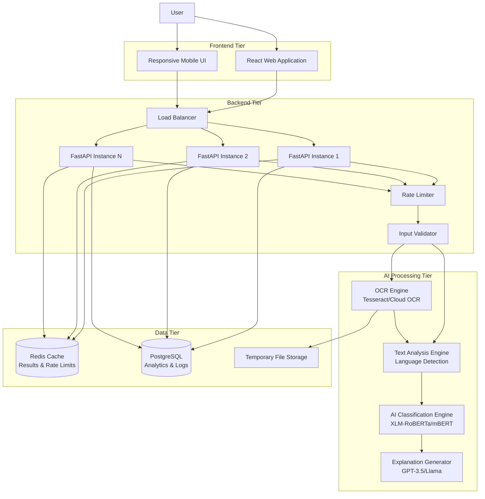
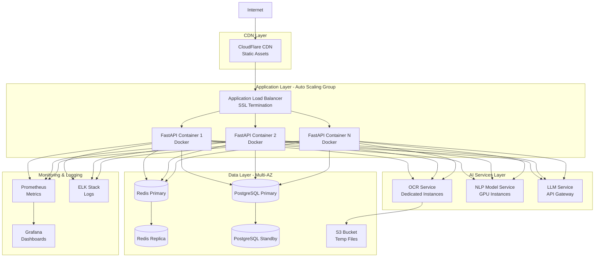
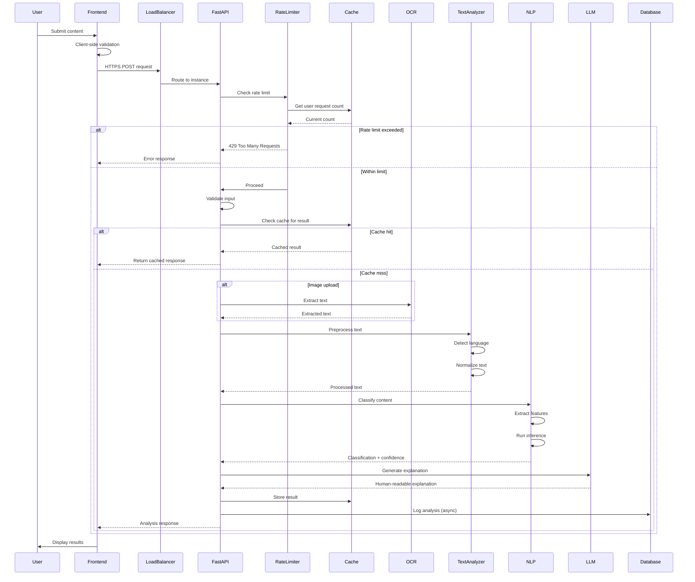
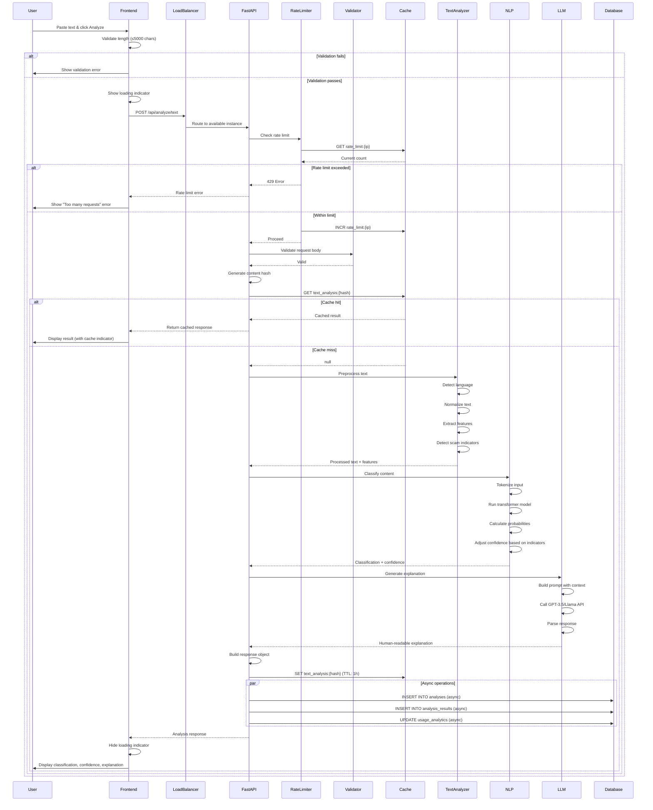
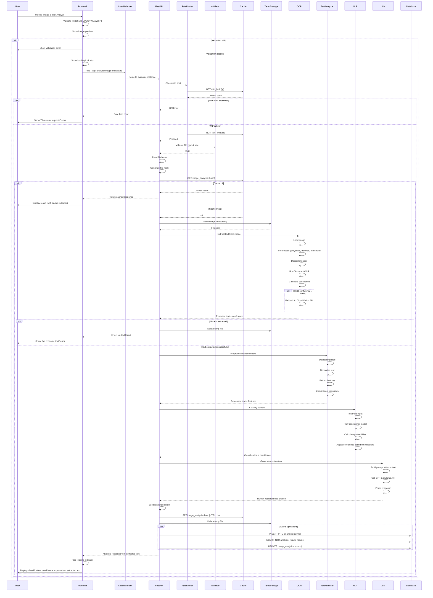
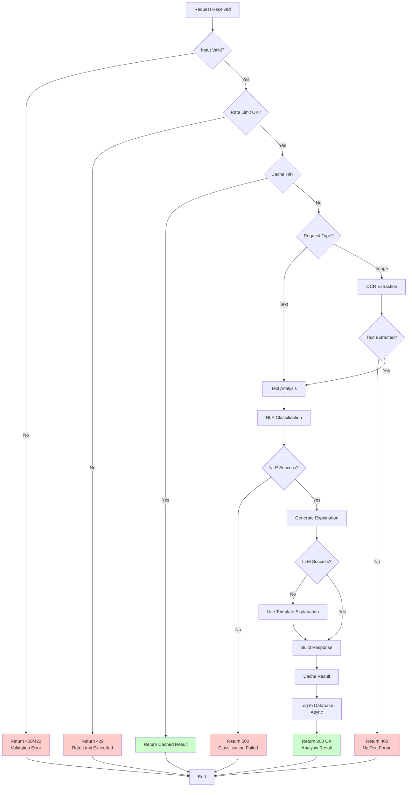

# Design Document - ScamShield AI

## Table of Contents

1. [Executive Summary](#executive-summary)
2. [System Architecture](#system-architecture)
   - [High-Level Architecture](#high-level-architecture)
   - [Deployment Architecture](#deployment-architecture)
   - [Component Interaction](#component-interaction)
3. [Component Design](#component-design)
   - [Frontend Dashboard](#frontend-dashboard)
   - [FastAPI Backend](#fastapi-backend)
   - [OCR Processing Service](#ocr-processing-service)
   - [Text Analysis Engine](#text-analysis-engine)
   - [AI Classification Engine](#ai-classification-engine)
   - [Explanation Generator](#explanation-generator)
   - [Redis Cache Layer](#redis-cache-layer)
   - [PostgreSQL Database](#postgresql-database)
4. [Data Flow](#data-flow)
   - [Text Analysis Flow](#text-analysis-flow)
   - [Image Analysis Flow](#image-analysis-flow)
5. [Technical Design Decisions](#technical-design-decisions)
6. [API Design](#api-design)
7. [Security](#security)
8. [Scalability](#scalability)
9. [Database Schema](#database-schema)
10. [Error Handling](#error-handling)
11. [Monitoring](#monitoring)
12. [Correctness Properties](#correctness-properties)
13. [Testing Strategy](#testing-strategy)

---

## Executive Summary

ScamShield AI is an enterprise-grade, AI-powered multilingual scam detection system that analyzes message content and screenshots to identify fraudulent communications. Unlike traditional spam detection systems that rely on sender reputation or phone number databases, ScamShield AI performs deep content-based analysis, making it effective against novel scams from unknown sources across any messaging platform (WhatsApp, SMS, Instagram, Email, Telegram).

The system architecture follows a modern 3-tier design with clear separation of concerns:

1. **Frontend Tier**: React.js web application with responsive UI for mobile and desktop
2. **Backend Tier**: Python FastAPI REST API with async processing, rate limiting, and input validation
3. **AI Processing Tier**: Text Analysis Engine, OCR Processing Service, AI Classification Engine, and Explanation Generator
4. **Data Tier**: PostgreSQL database with Redis caching layer for performance optimization

Key differentiators:
- Content-based detection independent of sender information
- Multilingual support (English, Hindi, Marathi)
- Explainable AI outputs with highlighted scam patterns
- Sub-3-second response times for 95% of requests
- Platform-agnostic design working across all messaging services

---

## System Architecture

### High-Level Architecture

The ScamShield AI system follows a modern 3-tier architecture with clear separation between presentation, application logic, AI processing, and data persistence layers.



### Deployment Architecture

The system is designed for cloud deployment with horizontal scalability and high availability.



### Component Interaction

Detailed interaction between system components showing request flow and data transformations.



---

## Component Design

### Frontend Dashboard

The frontend is a React.js single-page application providing an intuitive interface for scam detection.

#### Architecture

```
src/
├── components/
│   ├── InputForm/
│   │   ├── TextInput.tsx
│   │   ├── ImageUpload.tsx
│   │   └── SubmitButton.tsx
│   ├── ResultDisplay/
│   │   ├── ClassificationBadge.tsx
│   │   ├── ConfidenceBar.tsx
│   │   ├── ExplanationPanel.tsx
│   │   └── ScamIndicators.tsx
│   ├── ErrorDisplay/
│   │   └── ErrorMessage.tsx
│   └── Layout/
│       ├── Header.tsx
│       └── Footer.tsx
├── services/
│   └── api.ts
├── hooks/
│   ├── useAnalysis.ts
│   └── useFileUpload.ts
├── types/
│   └── analysis.ts
└── utils/
    └── validation.ts
```

#### Key Components

**1. InputForm Component**
**Responsibility**: Capture user input (text or screenshot)

**Interface**:
```typescript
interface InputFormProps {
  onSubmit: (content: TextContent | ImageContent) => Promise<void>;
  isLoading: boolean;
}

type TextContent = {
  type: 'text';
  content: string;
};

type ImageContent = {
  type: 'image';
  file: File;
};
```

**Behavior**:
- Validates text length (max 5,000 characters)
- Validates image size (max 5 MB)
- Validates image format (JPEG, PNG, WebP)
- Displays validation errors inline
- Disables submit during processing
- Provides real-time character count for text input
- Shows image preview before upload
- Supports drag-and-drop for image uploads

**Implementation Details**:
```typescript
// Client-side validation
const MAX_TEXT_LENGTH = 5000;
const MAX_FILE_SIZE = 5 * 1024 * 1024; // 5 MB
const ALLOWED_FORMATS = ['image/jpeg', 'image/png', 'image/webp'];

const validateTextInput = (text: string): ValidationResult => {
  if (!text.trim()) {
    return { valid: false, error: 'Please enter some text to analyze' };
  }
  if (text.length > MAX_TEXT_LENGTH) {
    return { 
      valid: false, 
      error: `Text exceeds maximum length of ${MAX_TEXT_LENGTH} characters` 
    };
  }
  return { valid: true };
};

const validateImageUpload = (file: File): ValidationResult => {
  if (!ALLOWED_FORMATS.includes(file.type)) {
    return { 
      valid: false, 
      error: 'Please upload a JPEG, PNG, or WebP image' 
    };
  }
  if (file.size > MAX_FILE_SIZE) {
    return { 
      valid: false, 
      error: 'Image size must be less than 5 MB' 
    };
  }
  return { valid: true };
};
```

#### 2. ResultDisplay Component
**Responsibility**: Display analysis results with classification, confidence, and explanation

**Interface**:
```typescript
interface ResultDisplayProps {
  result: AnalysisResult;
}

interface AnalysisResult {
  classification: 'scam' | 'safe';
  confidence: number; // 0-100
  explanation: string;
  detectedLanguage?: string;
  scamIndicators?: string[];
}
```

**Behavior**:
- Shows color-coded classification (red for scam, green for safe)
- Displays confidence as percentage with visual bar
- Renders explanation with proper formatting
- Highlights detected scam indicators as badges
- Shows detected language
- Provides "Analyze Another" button to reset
- Displays processing time for transparency

**Visual Design**:
```typescript
// Color scheme
const CLASSIFICATION_COLORS = {
  scam: {
    background: '#FEE2E2',
    border: '#DC2626',
    text: '#991B1B',
    icon: '⚠️'
  },
  safe: {
    background: '#D1FAE5',
    border: '#059669',
    text: '#065F46',
    icon: '✓'
  }
};

// Confidence level indicators
const getConfidenceLevel = (confidence: number): string => {
  if (confidence >= 90) return 'Very High';
  if (confidence >= 75) return 'High';
  if (confidence >= 60) return 'Moderate';
  return 'Low';
};
```

#### 3. ErrorDisplay Component
**Responsibility**: Display user-friendly error messages

**Interface**:
```typescript
interface ErrorDisplayProps {
  error: ErrorResponse;
  onRetry?: () => void;
}

interface ErrorResponse {
  code: string;
  message: string;
  details?: string;
}
```

**Interface**:
```typescript
interface ErrorDisplayProps {
  error: ErrorResponse;
  onRetry?: () => void;
}

interface ErrorResponse {
  code: string;
  message: string;
  details?: string;
}
```

**Behavior**:
- Displays user-friendly error messages with appropriate icons
- Provides retry button for transient errors
- Shows specific guidance for validation errors
- Logs errors to console for debugging
- Supports dismissible error alerts

---

### FastAPI Backend

The backend is built with FastAPI, providing high-performance async REST API endpoints with automatic OpenAPI documentation.

#### Architecture

```
app/
├── main.py                 # Application entry point
├── config.py              # Configuration management
├── routes/
│   ├── __init__.py
│   ├── analysis.py        # Analysis endpoints
│   └── health.py          # Health check endpoint
├── core/
│   ├── detector.py        # Scam detection orchestrator
│   ├── extractor.py       # OCR text extraction
│   ├── agent.py           # LLM explanation generator
│   └── memory.py          # Cache management
├── models/
│   ├── request.py         # Request models
│   └── response.py        # Response models
├── utils/
│   ├── auth.py            # Authentication (future)
│   ├── logger.py          # Logging configuration
│   └── validators.py      # Input validation
└── middleware/
    ├── rate_limiter.py    # Rate limiting
    ├── error_handler.py   # Global error handling
    └── cors.py            # CORS configuration
```

#### Middleware Stack

**1. Rate Limiting Middleware**

Prevents abuse by limiting requests per user/IP address.

```python
from fastapi import Request, HTTPException
from redis import Redis
import time

class RateLimiter:
    def __init__(self, redis_client: Redis, max_requests: int = 100, window: int = 3600):
        self.redis = redis_client
        self.max_requests = max_requests
        self.window = window  # Time window in seconds
    
    async def check_rate_limit(self, request: Request) -> bool:
        # Use IP address or API key as identifier
        identifier = request.client.host
        key = f"rate_limit:{identifier}"
        
        current = self.redis.get(key)
        
        if current is None:
            self.redis.setex(key, self.window, 1)
            return True
        
        if int(current) >= self.max_requests:
            raise HTTPException(
                status_code=429,
                detail={
                    "code": "RATE_LIMIT_EXCEEDED",
                    "message": f"Rate limit exceeded. Maximum {self.max_requests} requests per hour.",
                    "retry_after": self.redis.ttl(key)
                }
            )
        
        self.redis.incr(key)
        return True
```

**Rate Limit Configuration**:
- Free tier: 100 requests/hour per IP
- Authenticated users: 1,000 requests/hour (future enhancement)
- Burst allowance: 10 requests/minute

**2. Input Validation Middleware**

Validates and sanitizes all incoming requests before processing.

```python
from pydantic import BaseModel, Field, validator
from typing import Optional, Literal

class TextAnalysisRequest(BaseModel):
    content: str = Field(..., min_length=1, max_length=5000)
    language: Optional[Literal['en', 'hi', 'mr', 'auto']] = 'auto'
    
    @validator('content')
    def content_not_empty(cls, v):
        if not v.strip():
            raise ValueError('Content cannot be empty or whitespace only')
        return v.strip()
    
    @validator('content')
    def content_no_malicious_patterns(cls, v):
        # Basic XSS prevention
        dangerous_patterns = ['<script', 'javascript:', 'onerror=']
        for pattern in dangerous_patterns:
            if pattern.lower() in v.lower():
                raise ValueError('Content contains potentially malicious patterns')
        return v

class ImageAnalysisRequest(BaseModel):
    language: Optional[Literal['en', 'hi', 'mr', 'auto']] = 'auto'
```

**3. CORS Middleware**

Configures Cross-Origin Resource Sharing for frontend access.

```python
from fastapi.middleware.cors import CORSMiddleware

app.add_middleware(
    CORSMiddleware,
    allow_origins=[
        "https://scamshield.ai",
        "https://www.scamshield.ai",
        "http://localhost:3000"  # Development only
    ],
    allow_credentials=True,
    allow_methods=["GET", "POST"],
    allow_headers=["*"],
    max_age=3600
)
```

**4. Error Handling Middleware**

Global exception handler for consistent error responses.

```python
from fastapi import Request, status
from fastapi.responses import JSONResponse
from fastapi.exceptions import RequestValidationError
import logging

logger = logging.getLogger(__name__)

@app.exception_handler(RequestValidationError)
async def validation_exception_handler(request: Request, exc: RequestValidationError):
    logger.warning(f"Validation error: {exc.errors()}")
    return JSONResponse(
        status_code=status.HTTP_422_UNPROCESSABLE_ENTITY,
        content={
            "code": "VALIDATION_ERROR",
            "message": "Invalid input provided",
            "details": exc.errors()
        }
    )

@app.exception_handler(Exception)
async def general_exception_handler(request: Request, exc: Exception):
    logger.error(f"Unhandled exception: {str(exc)}", exc_info=True)
    return JSONResponse(
        status_code=status.HTTP_500_INTERNAL_SERVER_ERROR,
        content={
            "code": "INTERNAL_ERROR",
            "message": "An unexpected error occurred. Please try again later.",
            "details": None  # Never expose internal details
        }
    )
```

#### Endpoint Implementation

**1. POST /api/analyze/text**
**Purpose**: Analyze text content for scam indicators

**Implementation**:
```python
from fastapi import APIRouter, Depends, HTTPException
from app.models.request import TextAnalysisRequest
from app.models.response import AnalysisResponse
from app.core.detector import ScamDetector
from app.core.agent import ExplanationGenerator
from app.core.memory import CacheManager
import hashlib
import time

router = APIRouter()

@router.post("/api/analyze/text", response_model=AnalysisResponse)
async def analyze_text(
    request: TextAnalysisRequest,
    detector: ScamDetector = Depends(get_detector),
    explainer: ExplanationGenerator = Depends(get_explainer),
    cache: CacheManager = Depends(get_cache)
):
    start_time = time.time()
    
    # Generate cache key from content hash
    content_hash = hashlib.sha256(request.content.encode()).hexdigest()
    cache_key = f"text_analysis:{content_hash}"
    
    # Check cache
    cached_result = await cache.get(cache_key)
    if cached_result:
        return AnalysisResponse(**cached_result)
    
    # Perform analysis
    detection_result = await detector.analyze(
        text=request.content,
        language=request.language
    )
    
    # Generate explanation
    explanation = await explainer.generate(
        text=request.content,
        classification=detection_result.classification,
        scam_indicators=detection_result.scam_indicators,
        language=detection_result.detected_language
    )
    
    # Build response
    response = AnalysisResponse(
        classification=detection_result.classification,
        confidence=detection_result.confidence * 100,  # Convert to percentage
        explanation=explanation,
        detected_language=detection_result.detected_language,
        scam_indicators=detection_result.scam_indicators,
        processing_time=time.time() - start_time
    )
    
    # Cache result for 1 hour
    await cache.set(cache_key, response.dict(), ttl=3600)
    
    # Log analysis asynchronously (fire and forget)
    asyncio.create_task(log_analysis(request, response))
    
    return response
```

**Request**:
```json
{
  "content": "Congratulations! You've won $1,000,000. Click here to claim your prize now!",
  "language": "auto"
}
```

**Response** (200 OK):
```json
{
  "classification": "scam",
  "confidence": 94.5,
  "explanation": "This message exhibits classic scam indicators: it promises an unrealistic prize ($1,000,000) without any legitimate context, creates urgency with 'now', and likely contains a suspicious link. Legitimate prize notifications don't work this way.",
  "detected_language": "en",
  "scam_indicators": ["fake_prize", "urgency", "suspicious_link"],
  "processing_time": 1.23
}
```

**Error Responses**:
- 400: Invalid input (empty content, exceeds length)
- 413: Content too large
- 422: Validation error
- 429: Rate limit exceeded
- 500: Internal server error
- 504: Processing timeout

#### 2. POST /api/analyze/image
**Purpose**: Extract text from image and analyze for scam indicators

**Implementation**:
```python
from fastapi import UploadFile, File
from app.core.extractor import OCREngine

@router.post("/api/analyze/image", response_model=AnalysisResponse)
async def analyze_image(
    file: UploadFile = File(...),
    language: str = 'auto',
    detector: ScamDetector = Depends(get_detector),
    explainer: ExplanationGenerator = Depends(get_explainer),
    ocr: OCREngine = Depends(get_ocr),
    cache: CacheManager = Depends(get_cache)
):
    start_time = time.time()
    
    # Validate file
    if file.content_type not in ['image/jpeg', 'image/png', 'image/webp']:
        raise HTTPException(
            status_code=400,
            detail={
                "code": "INVALID_FILE_FORMAT",
                "message": "Only JPEG, PNG, and WebP images are supported"
            }
        )
    
    # Read file content
    file_content = await file.read()
    
    if len(file_content) > 5 * 1024 * 1024:  # 5 MB
        raise HTTPException(
            status_code=413,
            detail={
                "code": "FILE_TOO_LARGE",
                "message": "Image size must be less than 5 MB"
            }
        )
    
    # Generate cache key from file hash
    file_hash = hashlib.sha256(file_content).hexdigest()
    cache_key = f"image_analysis:{file_hash}"
    
    # Check cache
    cached_result = await cache.get(cache_key)
    if cached_result:
        return AnalysisResponse(**cached_result)
    
    # Extract text using OCR
    ocr_result = await ocr.extract_text(file_content)
    
    if not ocr_result.text or len(ocr_result.text.strip()) == 0:
        raise HTTPException(
            status_code=400,
            detail={
                "code": "NO_TEXT_EXTRACTED",
                "message": "Could not extract readable text from the image",
                "details": "Please ensure the image contains clear, readable text and try again."
            }
        )
    
    # Perform scam detection on extracted text
    detection_result = await detector.analyze(
        text=ocr_result.text,
        language=language if language != 'auto' else ocr_result.language
    )
    
    # Generate explanation
    explanation = await explainer.generate(
        text=ocr_result.text,
        classification=detection_result.classification,
        scam_indicators=detection_result.scam_indicators,
        language=detection_result.detected_language
    )
    
    # Build response
    response = AnalysisResponse(
        classification=detection_result.classification,
        confidence=detection_result.confidence * 100,
        explanation=explanation,
        detected_language=detection_result.detected_language,
        scam_indicators=detection_result.scam_indicators,
        extracted_text=ocr_result.text,
        processing_time=time.time() - start_time
    )
    
    # Cache result for 1 hour
    await cache.set(cache_key, response.dict(), ttl=3600)
    
    # Log analysis asynchronously
    asyncio.create_task(log_analysis({"type": "image", "extracted_text": ocr_result.text}, response))
    
    return response
```

**Request**: Multipart form data
- `file`: Image file (max 5 MB)
- `language`: Optional language hint ('en', 'hi', 'mr', 'auto')

**Response** (200 OK):
```json
{
  "classification": "scam",
  "confidence": 87.3,
  "explanation": "यह संदेश एक घोटाला है। इसमें OTP कोड मांगा गया है और तत्काल कार्रवाई का दबाव है। वैध संस्थाएं कभी भी OTP नहीं मांगती।",
  "extracted_text": "आपका खाता ब्लॉक हो गया है। तुरंत OTP भेजें: 9876543210",
  "detected_language": "hi",
  "scam_indicators": ["otp_request", "urgency", "threat"],
  "processing_time": 2.45
}
```

**Error Responses**:
- 400: Invalid file format or no text extracted
- 413: File too large
- 422: Validation error
- 429: Rate limit exceeded
- 500: Internal server error
- 504: Processing timeout

#### 3. GET /api/health
**Purpose**: Health check endpoint for monitoring and load balancer probes

**Implementation**:
```python
@router.get("/api/health", response_model=HealthResponse)
async def health_check(
    detector: ScamDetector = Depends(get_detector),
    ocr: OCREngine = Depends(get_ocr),
    cache: CacheManager = Depends(get_cache),
    db: Database = Depends(get_database)
):
    services_status = {}
    overall_status = "healthy"
    
    # Check NLP service
    try:
        await detector.health_check()
        services_status["nlp"] = "operational"
    except Exception as e:
        services_status["nlp"] = "degraded"
        overall_status = "degraded"
        logger.error(f"NLP health check failed: {e}")
    
    # Check OCR service
    try:
        await ocr.health_check()
        services_status["ocr"] = "operational"
    except Exception as e:
        services_status["ocr"] = "degraded"
        overall_status = "degraded"
        logger.error(f"OCR health check failed: {e}")
    
    # Check Redis cache
    try:
        await cache.ping()
        services_status["cache"] = "operational"
    except Exception as e:
        services_status["cache"] = "degraded"
        overall_status = "degraded"
        logger.error(f"Cache health check failed: {e}")
    
    # Check database
    try:
        await db.ping()
        services_status["database"] = "operational"
    except Exception as e:
        services_status["database"] = "degraded"
        overall_status = "degraded"
        logger.error(f"Database health check failed: {e}")
    
    return HealthResponse(
        status=overall_status,
        services=services_status,
        uptime=get_uptime_seconds(),
        version="1.0.0"
    )
```

**Response** (200 OK):
```json
{
  "status": "healthy",
  "services": {
    "nlp": "operational",
    "ocr": "operational",
    "cache": "operational",
    "database": "operational"
  },
  "uptime": 86400,
  "version": "1.0.0"
}
```

---

### OCR Processing Service

Extracts text from uploaded images using Optical Character Recognition.

#### Implementation Strategy

**Primary OCR Engine**: Tesseract OCR with language packs
- Supports English, Hindi (Devanagari), and Marathi
- Open-source and self-hosted for data privacy
- Fast processing for most images

**Fallback OCR Engine**: Google Cloud Vision API
- Used when Tesseract confidence < 0.5
- Better accuracy for low-quality images
- Handles complex layouts and handwriting

#### OCR Pipeline

```python
from PIL import Image
import pytesseract
import cv2
import numpy as np
from dataclasses import dataclass

@dataclass
class OCRResult:
    text: str
    confidence: float
    language: str

class OCREngine:
    def __init__(self):
        self.tesseract_config = r'--oem 3 --psm 6'
        self.supported_languages = {
            'en': 'eng',
            'hi': 'hin',
            'mr': 'mar'
        }
    
    async def extract_text(self, image_bytes: bytes) -> OCRResult:
        # Convert bytes to image
        image = Image.open(io.BytesIO(image_bytes))
        
        # Preprocess image
        processed_image = self._preprocess_image(image)
        
        # Detect language
        detected_lang = self._detect_language(processed_image)
        
        # Extract text with Tesseract
        tesseract_lang = self.supported_languages.get(detected_lang, 'eng')
        text = pytesseract.image_to_string(
            processed_image,
            lang=tesseract_lang,
            config=self.tesseract_config
        )
        
        # Get confidence score
        data = pytesseract.image_to_data(processed_image, output_type=pytesseract.Output.DICT)
        confidences = [int(conf) for conf in data['conf'] if conf != '-1']
        avg_confidence = sum(confidences) / len(confidences) if confidences else 0
        
        # Fallback to Cloud Vision if confidence is low
        if avg_confidence < 50 and text.strip():
            text, avg_confidence = await self._cloud_ocr_fallback(image_bytes)
        
        return OCRResult(
            text=text.strip(),
            confidence=avg_confidence / 100,
            language=detected_lang
        )
    
    def _preprocess_image(self, image: Image) -> np.ndarray:
        # Convert to OpenCV format
        img_array = np.array(image)
        
        # Convert to grayscale
        if len(img_array.shape) == 3:
            gray = cv2.cvtColor(img_array, cv2.COLOR_RGB2GRAY)
        else:
            gray = img_array
        
        # Apply denoising
        denoised = cv2.fastNlMeansDenoising(gray)
        
        # Apply adaptive thresholding
        thresh = cv2.adaptiveThreshold(
            denoised, 255, cv2.ADAPTIVE_THRESH_GAUSSIAN_C, cv2.THRESH_BINARY, 11, 2
        )
        
        # Deskew if needed
        deskewed = self._deskew(thresh)
        
        return deskewed
    
    def _detect_language(self, image: np.ndarray) -> str:
        # Use Tesseract's language detection
        osd = pytesseract.image_to_osd(image)
        # Parse script from OSD output
        # Default to English if detection fails
        return 'en'
    
    async def _cloud_ocr_fallback(self, image_bytes: bytes) -> tuple[str, float]:
        # Implement Google Cloud Vision API call
        # Return extracted text and confidence
        pass
    
    async def health_check(self) -> bool:
        # Test OCR with a simple image
        test_image = self._generate_test_image()
        result = await self.extract_text(test_image)
        return len(result.text) > 0
```

---

### Text Analysis Engine

Preprocesses and normalizes text before classification.

#### Responsibilities

1. Language detection
2. Text normalization
3. Tokenization
4. Feature extraction
5. Pattern recognition

#### Implementation

```python
from langdetect import detect, LangDetectException
import re
from typing import List, Dict

class TextAnalyzer:
    def __init__(self):
        self.language_map = {
            'en': 'english',
            'hi': 'hindi',
            'mr': 'marathi'
        }
        
        # Scam pattern keywords by language
        self.scam_patterns = {
            'urgency': {
                'en': ['urgent', 'immediately', 'act now', 'limited time', 'expires', 'hurry'],
                'hi': ['तुरंत', 'जल्दी', 'अभी', 'सीमित समय'],
                'mr': ['त्वरित', 'लगेच', 'आता']
            },
            'fake_prize': {
                'en': ['won', 'winner', 'prize', 'reward', 'claim', 'congratulations', 'lottery'],
                'hi': ['जीता', 'इनाम', 'पुरस्कार', 'बधाई'],
                'mr': ['जिंकले', 'बक्षीस', 'पारितोषिक']
            },
            'otp_request': {
                'en': ['otp', 'verification code', 'pin', 'password', 'cvv'],
                'hi': ['ओटीपी', 'सत्यापन कोड', 'पासवर्ड'],
                'mr': ['ओटीपी', 'पिन', 'पासवर्ड']
            },
            'threat': {
                'en': ['blocked', 'suspended', 'legal action', 'arrest', 'penalty', 'fine'],
                'hi': ['ब्लॉक', 'निलंबित', 'कानूनी कार्रवाई', 'जुर्माना'],
                'mr': ['ब्लॉक', 'निलंबित', 'कायदेशीर कारवाई']
            },
            'impersonation': {
                'en': ['bank', 'government', 'police', 'tax', 'official', 'authority'],
                'hi': ['बैंक', 'सरकार', 'पुलिस', 'कर', 'अधिकारी'],
                'mr': ['बँक', 'सरकार', 'पोलीस', 'कर']
            }
        }
    
    def detect_language(self, text: str) -> str:
        try:
            lang_code = detect(text)
            if lang_code in self.language_map:
                return lang_code
            return 'en'  # Default to English
        except LangDetectException:
            return 'en'
    
    def normalize_text(self, text: str, language: str) -> str:
        # Convert to lowercase
        normalized = text.lower()
        
        # Remove extra whitespace
        normalized = re.sub(r'\s+', ' ', normalized)
        
        # Remove special characters but keep language-specific characters
        if language in ['hi', 'mr']:
            # Keep Devanagari characters
            normalized = re.sub(r'[^\w\s\u0900-\u097F]', ' ', normalized)
        else:
            normalized = re.sub(r'[^\w\s]', ' ', normalized)
        
        return normalized.strip()
    
    def extract_features(self, text: str, language: str) -> Dict[str, any]:
        normalized = self.normalize_text(text, language)
        
        features = {
            'length': len(text),
            'word_count': len(normalized.split()),
            'has_url': bool(re.search(r'http[s]?://|www\.', text)),
            'has_phone': bool(re.search(r'\d{10}', text)),
            'has_email': bool(re.search(r'\S+@\S+', text)),
            'uppercase_ratio': sum(1 for c in text if c.isupper()) / len(text) if text else 0,
            'digit_ratio': sum(1 for c in text if c.isdigit()) / len(text) if text else 0,
            'scam_indicators': self.detect_scam_indicators(normalized, language)
        }
        
        return features
    
    def detect_scam_indicators(self, normalized_text: str, language: str) -> List[str]:
        indicators = []
        
        for indicator_type, patterns in self.scam_patterns.items():
            lang_patterns = patterns.get(language, patterns.get('en', []))
            for pattern in lang_patterns:
                if pattern in normalized_text:
                    indicators.append(indicator_type)
                    break
        
        return list(set(indicators))  # Remove duplicates
```

---

### AI Classification Engine

Core NLP model for scam detection using transformer-based architecture.

#### Model Architecture

**Base Model**: XLM-RoBERTa (Cross-lingual Language Model)
- Pre-trained on 100 languages including English, Hindi, and Marathi
- 125M parameters (base) or 355M parameters (large)
- Supports multilingual text without translation

**Fine-tuning Strategy**:
1. Collect labeled dataset of scam/safe messages in all supported languages
2. Balance dataset (50% scam, 50% safe)
3. Fine-tune on binary classification task
4. Use weighted loss to penalize false negatives more than false positives

#### Implementation

```python
import torch
from transformers import XLMRobertaTokenizer, XLMRobertaForSequenceClassification
from typing import List, Literal
from dataclasses import dataclass

@dataclass
class DetectionResult:
    classification: Literal['scam', 'safe']
    confidence: float  # 0.0 to 1.0
    scam_indicators: List[str]
    detected_language: str

class ScamDetector:
    def __init__(self, model_path: str = "xlm-roberta-base-scam-detector"):
        self.device = torch.device("cuda" if torch.cuda.is_available() else "cpu")
        self.tokenizer = XLMRobertaTokenizer.from_pretrained(model_path)
        self.model = XLMRobertaForSequenceClassification.from_pretrained(model_path)
        self.model.to(self.device)
        self.model.eval()
        
        self.text_analyzer = TextAnalyzer()
        self.label_map = {0: 'safe', 1: 'scam'}
    
    async def analyze(self, text: str, language: str = 'auto') -> DetectionResult:
        # Detect language if auto
        if language == 'auto':
            detected_language = self.text_analyzer.detect_language(text)
        else:
            detected_language = language
        
        # Extract features and indicators
        features = self.text_analyzer.extract_features(text, detected_language)
        scam_indicators = features['scam_indicators']
        
        # Tokenize input
        inputs = self.tokenizer(
            text,
            return_tensors="pt",
            truncation=True,
            max_length=512,
            padding=True
        ).to(self.device)
        
        # Run inference
        with torch.no_grad():
            outputs = self.model(**inputs)
            logits = outputs.logits
            probabilities = torch.softmax(logits, dim=1)
        
        # Get prediction
        predicted_class = torch.argmax(probabilities, dim=1).item()
        confidence = probabilities[0][predicted_class].item()
        classification = self.label_map[predicted_class]
        
        # Adjust confidence based on detected indicators
        if len(scam_indicators) >= 3 and classification == 'scam':
            confidence = min(confidence + 0.1, 1.0)  # Boost confidence
        elif len(scam_indicators) == 0 and classification == 'scam':
            confidence = max(confidence - 0.15, 0.5)  # Reduce confidence
        
        return DetectionResult(
            classification=classification,
            confidence=confidence,
            scam_indicators=scam_indicators,
            detected_language=detected_language
        )
    
    async def health_check(self) -> bool:
        # Test with a simple message
        test_text = "Hello, this is a test message."
        result = await self.analyze(test_text)
        return result.classification in ['scam', 'safe']
```

#### Model Training Pipeline

```python
# Training configuration
TRAINING_CONFIG = {
    'model_name': 'xlm-roberta-base',
    'num_epochs': 5,
    'batch_size': 16,
    'learning_rate': 2e-5,
    'weight_decay': 0.01,
    'warmup_steps': 500,
    'max_length': 512,
    'class_weights': [1.0, 1.5],  # Penalize false negatives more
    'validation_split': 0.2,
    'early_stopping_patience': 2
}

# Dataset structure
# scam_dataset/
#   ├── train/
#   │   ├── scam_en.jsonl
#   │   ├── scam_hi.jsonl
#   │   ├── scam_mr.jsonl
#   │   ├── safe_en.jsonl
#   │   ├── safe_hi.jsonl
#   │   └── safe_mr.jsonl
#   └── test/
#       └── ... (same structure)
```

---

### Explanation Generator

Generates human-readable explanations using Large Language Models.

#### Implementation

```python
from openai import AsyncOpenAI
from typing import List, Literal

class ExplanationGenerator:
    def __init__(self, api_key: str, model: str = "gpt-3.5-turbo"):
        self.client = AsyncOpenAI(api_key=api_key)
        self.model = model
        
        self.prompt_templates = {
            'en': """You are a scam detection expert. Analyze the following message and explain why it was classified as {classification}.

Message: "{text}"
Classification: {classification}
Confidence: {confidence}%
Detected Indicators: {indicators}

Provide a clear, concise explanation (2-3 sentences) that:
1. States whether the message is a scam or safe
2. Highlights specific red flags or safe indicators
3. Educates the user about scam tactics (if applicable)

Keep the explanation under 100 words and suitable for non-technical users.""",
            
            'hi': """आप एक घोटाला पहचान विशेषज्ञ हैं। निम्नलिखित संदेश का विश्लेषण करें और समझाएं कि इसे {classification} के रूप में क्यों वर्गीकृत किया गया।

संदेश: "{text}"
वर्गीकरण: {classification}
विश्वास: {confidence}%
पहचाने गए संकेतक: {indicators}

एक स्पष्ट, संक्षिप्त स्पष्टीकरण (2-3 वाक्य) प्रदान करें जो:
1. बताए कि संदेश घोटाला है या सुरक्षित
2. विशिष्ट खतरे के संकेतों या सुरक्षित संकेतकों को उजागर करे
3. उपयोगकर्ता को घोटाले की रणनीति के बारे में शिक्षित करे (यदि लागू हो)

स्पष्टीकरण को 100 शब्दों से कम रखें और गैर-तकनीकी उपयोगकर्ताओं के लिए उपयुक्त बनाएं।""",
            
            'mr': """तुम्ही एक घोटाळा शोध तज्ञ आहात. खालील संदेशाचे विश्लेषण करा आणि ते {classification} म्हणून का वर्गीकृत केले गेले ते स्पष्ट करा।

संदेश: "{text}"
वर्गीकरण: {classification}
आत्मविश्वास: {confidence}%
ओळखले गेलेले सूचक: {indicators}

एक स्पष्ट, संक्षिप्त स्पष्टीकरण (2-3 वाक्ये) प्रदान करा जे:
1. संदेश घोटाळा आहे की सुरक्षित आहे ते सांगा
2. विशिष्ट धोक्याचे संकेत किंवा सुरक्षित सूचक हायलाइट करा
3. वापरकर्त्याला घोटाळ्याच्या युक्त्यांबद्दल शिक्षित करा (लागू असल्यास)

स्पष्टीकरण 100 शब्दांपेक्षा कमी ठेवा आणि गैर-तांत्रिक वापरकर्त्यांसाठी योग्य बनवा।"""
        }
    
    async def generate(
        self,
        text: str,
        classification: Literal['scam', 'safe'],
        scam_indicators: List[str],
        language: str = 'en'
    ) -> str:
        # Select appropriate prompt template
        template = self.prompt_templates.get(language, self.prompt_templates['en'])
        
        # Format indicators for display
        indicators_str = ', '.join(scam_indicators) if scam_indicators else 'none'
        
        # Build prompt
        prompt = template.format(
            text=text[:500],  # Limit text length in prompt
            classification='घोटाला' if language == 'hi' and classification == 'scam' else 
                          'घोटाळा' if language == 'mr' and classification == 'scam' else
                          'सुरक्षित' if language in ['hi', 'mr'] and classification == 'safe' else
                          classification,
            confidence=85,  # Placeholder
            indicators=indicators_str
        )
        
        try:
            # Call LLM API
            response = await self.client.chat.completions.create(
                model=self.model,
                messages=[
                    {"role": "system", "content": "You are a helpful scam detection assistant."},
                    {"role": "user", "content": prompt}
                ],
                max_tokens=150,
                temperature=0.7
            )
            
            explanation = response.choices[0].message.content.strip()
            return explanation
            
        except Exception as e:
            logger.error(f"LLM explanation generation failed: {e}")
            # Fallback to template-based explanation
            return self._generate_fallback_explanation(classification, scam_indicators, language)
    
    def _generate_fallback_explanation(
        self,
        classification: Literal['scam', 'safe'],
        scam_indicators: List[str],
        language: str
    ) -> str:
        # Simple template-based explanations as fallback
        if classification == 'scam':
            if language == 'hi':
                return f"यह संदेश एक घोटाला प्रतीत होता है। पहचाने गए संकेत: {', '.join(scam_indicators)}। कृपया सावधान रहें।"
            elif language == 'mr':
                return f"हा संदेश घोटाळा असल्याचे दिसते। ओळखले गेलेले सूचक: {', '.join(scam_indicators)}। कृपया सावध रहा।"
            else:
                return f"This message appears to be a scam. Detected indicators: {', '.join(scam_indicators)}. Please be cautious."
        else:
            if language == 'hi':
                return "यह संदेश सुरक्षित प्रतीत होता है। कोई महत्वपूर्ण घोटाले के संकेत नहीं मिले।"
            elif language == 'mr':
                return "हा संदेश सुरक्षित असल्याचे दिसते। कोणतेही महत्त्वपूर्ण घोटाळ्याचे सूचक आढळले नाहीत।"
            else:
                return "This message appears to be safe. No significant scam indicators were detected."
```

---

### Redis Cache Layer

Provides high-performance caching for analysis results and rate limiting.

#### Cache Strategy

**Cache Keys**:
- `text_analysis:{content_hash}` - Cached text analysis results
- `image_analysis:{file_hash}` - Cached image analysis results
- `rate_limit:{ip_address}` - Request count for rate limiting
- `rate_limit:{api_key}` - Request count for authenticated users

**TTL (Time To Live)**:
- Analysis results: 1 hour (3600 seconds)
- Rate limit counters: 1 hour (rolling window)

#### Implementation

```python
import redis.asyncio as redis
import json
from typing import Optional, Any

class CacheManager:
    def __init__(self, redis_url: str = "redis://localhost:6379"):
        self.redis = redis.from_url(redis_url, decode_responses=True)
    
    async def get(self, key: str) -> Optional[dict]:
        try:
            value = await self.redis.get(key)
            if value:
                return json.loads(value)
            return None
        except Exception as e:
            logger.error(f"Cache get error: {e}")
            return None
    
    async def set(self, key: str, value: dict, ttl: int = 3600) -> bool:
        try:
            await self.redis.setex(key, ttl, json.dumps(value))
            return True
        except Exception as e:
            logger.error(f"Cache set error: {e}")
            return False
    
    async def increment(self, key: str, ttl: int = 3600) -> int:
        try:
            count = await self.redis.incr(key)
            if count == 1:
                await self.redis.expire(key, ttl)
            return count
        except Exception as e:
            logger.error(f"Cache increment error: {e}")
            return 0
    
    async def ping(self) -> bool:
        try:
            await self.redis.ping()
            return True
        except Exception as e:
            logger.error(f"Cache ping error: {e}")
            return False
    
    async def close(self):
        await self.redis.close()
```

#### Cache Hit Rate Optimization

**Expected Cache Hit Rates**:
- Text analysis: 30-40% (many users check similar scam messages)
- Image analysis: 15-25% (screenshots are more unique)
- Overall: 25-35%

**Cache Warming Strategy**:
- Pre-cache common scam patterns during deployment
- Monitor popular scam messages and pre-cache variations

---

### PostgreSQL Database

Stores anonymized analytics and usage logs for system improvement.

#### Database Schema

```sql
-- Users table (future enhancement for authentication)
CREATE TABLE users (
    id UUID PRIMARY KEY DEFAULT gen_random_uuid(),
    email VARCHAR(255) UNIQUE,
    api_key VARCHAR(64) UNIQUE,
    tier VARCHAR(20) DEFAULT 'free',
    created_at TIMESTAMP DEFAULT CURRENT_TIMESTAMP,
    last_active_at TIMESTAMP,
    is_active BOOLEAN DEFAULT TRUE
);

CREATE INDEX idx_users_api_key ON users(api_key);
CREATE INDEX idx_users_email ON users(email);

-- Analyses table (anonymized logs)
CREATE TABLE analyses (
    id UUID PRIMARY KEY DEFAULT gen_random_uuid(),
    user_id UUID REFERENCES users(id) ON DELETE SET NULL,
    analysis_type VARCHAR(10) NOT NULL CHECK (analysis_type IN ('text', 'image')),
    classification VARCHAR(10) NOT NULL CHECK (classification IN ('scam', 'safe')),
    confidence DECIMAL(5,2) NOT NULL CHECK (confidence >= 0 AND confidence <= 100),
    detected_language VARCHAR(5),
    scam_indicators JSONB,
    processing_time DECIMAL(6,3),
    content_hash VARCHAR(64) NOT NULL,  -- SHA-256 hash for deduplication
    created_at TIMESTAMP DEFAULT CURRENT_TIMESTAMP,
    ip_address INET,  -- For abuse detection
    user_agent TEXT
);

CREATE INDEX idx_analyses_created_at ON analyses(created_at DESC);
CREATE INDEX idx_analyses_classification ON analyses(classification);
CREATE INDEX idx_analyses_content_hash ON analyses(content_hash);
CREATE INDEX idx_analyses_user_id ON analyses(user_id);

-- Analysis results table (detailed results)
CREATE TABLE analysis_results (
    id UUID PRIMARY KEY DEFAULT gen_random_uuid(),
    analysis_id UUID REFERENCES analyses(id) ON DELETE CASCADE,
    explanation TEXT,
    extracted_text TEXT,  -- For image analyses
    features JSONB,  -- Extracted features
    model_version VARCHAR(20),
    created_at TIMESTAMP DEFAULT CURRENT_TIMESTAMP
);

CREATE INDEX idx_analysis_results_analysis_id ON analysis_results(analysis_id);

-- Usage analytics table (aggregated metrics)
CREATE TABLE usage_analytics (
    id UUID PRIMARY KEY DEFAULT gen_random_uuid(),
    date DATE NOT NULL,
    hour INTEGER CHECK (hour >= 0 AND hour < 24),
    total_requests INTEGER DEFAULT 0,
    text_requests INTEGER DEFAULT 0,
    image_requests INTEGER DEFAULT 0,
    scam_detections INTEGER DEFAULT 0,
    safe_detections INTEGER DEFAULT 0,
    avg_confidence DECIMAL(5,2),
    avg_processing_time DECIMAL(6,3),
    cache_hits INTEGER DEFAULT 0,
    cache_misses INTEGER DEFAULT 0,
    errors INTEGER DEFAULT 0,
    created_at TIMESTAMP DEFAULT CURRENT_TIMESTAMP,
    UNIQUE(date, hour)
);

CREATE INDEX idx_usage_analytics_date ON usage_analytics(date DESC);

-- Scam patterns table (for model improvement)
CREATE TABLE scam_patterns (
    id UUID PRIMARY KEY DEFAULT gen_random_uuid(),
    pattern_type VARCHAR(50) NOT NULL,
    pattern_text TEXT NOT NULL,
    language VARCHAR(5) NOT NULL,
    frequency INTEGER DEFAULT 1,
    first_seen TIMESTAMP DEFAULT CURRENT_TIMESTAMP,
    last_seen TIMESTAMP DEFAULT CURRENT_TIMESTAMP,
    is_active BOOLEAN DEFAULT TRUE
);

CREATE INDEX idx_scam_patterns_type ON scam_patterns(pattern_type);
CREATE INDEX idx_scam_patterns_language ON scam_patterns(language);

-- System metrics table (for monitoring)
CREATE TABLE system_metrics (
    id UUID PRIMARY KEY DEFAULT gen_random_uuid(),
    metric_name VARCHAR(100) NOT NULL,
    metric_value DECIMAL(10,2) NOT NULL,
    metric_unit VARCHAR(20),
    recorded_at TIMESTAMP DEFAULT CURRENT_TIMESTAMP
);

CREATE INDEX idx_system_metrics_name_time ON system_metrics(metric_name, recorded_at DESC);
```

#### Data Retention Policy

- **Analyses**: Retain for 90 days, then archive or delete
- **Usage Analytics**: Retain indefinitely (aggregated data)
- **System Metrics**: Retain for 30 days
- **Scam Patterns**: Retain indefinitely (for model training)

#### Privacy Considerations

- **No PII Storage**: Never store actual message content, only hashes
- **Anonymization**: Remove or hash IP addresses after 7 days
- **Opt-out**: Users can request deletion of their analysis history
- **Compliance**: GDPR and CCPA compliant data handling

---
**Responsibility**: Analyze text content and classify as scam or safe

**Interface**:
```python
class ScamDetector:
    def analyze(self, text: str, language: str = 'auto') -> DetectionResult:
        """
        Analyze text for scam indicators.
        
        Args:
            text: Input text to analyze
            language: Language code ('en', 'hi', 'mr', 'auto')
            
        Returns:
            DetectionResult with classification and confidence
        """
        pass

@dataclass
class DetectionResult:
    classification: Literal['scam', 'safe']
    confidence: float  # 0.0 to 1.0
    scam_indicators: List[str]
    detected_language: str
```

**Implementation Approach**:
- Use pre-trained multilingual transformer model (e.g., XLM-RoBERTa, mBERT)
- Fine-tune on scam/safe dataset in English, Hindi, and Marathi
- Extract features: urgency keywords, suspicious patterns, link presence, OTP mentions
- Output probability distribution over scam/safe classes
- Threshold: confidence > 0.7 for high-confidence classification

**Scam Indicators Detected**:
- `urgency`: Time-pressure tactics ("act now", "limited time")
- `fake_prize`: Prize/reward claims ("you won", "claim reward")
- `otp_request`: Requests for OTP or verification codes
- `suspicious_link`: Shortened URLs or suspicious domains
- `threat`: Threatening language ("account blocked", "legal action")
- `impersonation`: Claims to be from banks, government, or companies
- `personal_info_request`: Requests for passwords, card details, etc.

#### 2. OCREngine
**Responsibility**: Extract text from uploaded images

**Interface**:
```python
class OCREngine:
    def extract_text(self, image_bytes: bytes) -> OCRResult:
        """
        Extract text from image using OCR.
        
        Args:
            image_bytes: Image file as bytes
            
        Returns:
            OCRResult with extracted text and confidence
        """
        pass

@dataclass
class OCRResult:
    text: str
    confidence: float
    language: str
```

**Implementation Approach**:
- Use Tesseract OCR or cloud-based OCR (Google Vision API, AWS Textract)
- Support English, Hindi (Devanagari script), and Marathi
- Preprocess images: grayscale conversion, noise reduction, contrast enhancement
- Handle various image qualities and orientations
- Return empty text if confidence < 0.5

#### 3. ExplanationGenerator (LLM)
**Responsibility**: Generate human-readable explanations for classifications

**Interface**:
```python
class ExplanationGenerator:
    def generate(
        self, 
        text: str, 
        classification: str, 
        scam_indicators: List[str],
        language: str = 'en'
    ) -> str:
        """
        Generate explanation for classification.
        
        Args:
            text: Original analyzed text
            classification: 'scam' or 'safe'
            scam_indicators: List of detected indicators
            language: Target language for explanation
            
        Returns:
            Human-readable explanation string
        """
        pass
```

**Implementation Approach**:
- Use GPT-3.5/GPT-4 or open-source LLM (Llama, Mistral)
- Prompt engineering: Include classification, indicators, and text snippet
- Generate explanations in the same language as input (when possible)
- Keep explanations concise (2-4 sentences)
- Highlight specific scam tactics found in the message
- For safe messages, explain why no significant threats were detected

**Example Prompt Template**:
```
You are a scam detection expert. Analyze the following message and explain why it was classified as {classification}.

Message: "{text}"
Classification: {classification}
Confidence: {confidence}%
Detected Indicators: {scam_indicators}

Provide a clear, concise explanation in {language} that:
1. States whether the message is a scam or safe
2. Highlights specific red flags or safe indicators
3. Educates the user about scam tactics (if applicable)

Keep the explanation under 100 words and suitable for non-technical users.
```

## Data Models

### Request Models

```python
from pydantic import BaseModel, Field, validator
from typing import Literal, Optional

class TextAnalysisRequest(BaseModel):
    content: str = Field(..., min_length=1, max_length=5000)
    language: Optional[Literal['en', 'hi', 'mr', 'auto']] = 'auto'
    
    @validator('content')
    def content_not_empty(cls, v):
        if not v.strip():
            raise ValueError('Content cannot be empty or whitespace only')
        return v

class ImageAnalysisRequest(BaseModel):
    file: bytes = Field(..., max_length=5 * 1024 * 1024)  # 5 MB
    language: Optional[Literal['en', 'hi', 'mr', 'auto']] = 'auto'
```

### Response Models

```python
from pydantic import BaseModel, Field
from typing import List, Literal, Optional

class AnalysisResponse(BaseModel):
    classification: Literal['scam', 'safe']
    confidence: float = Field(..., ge=0, le=100)
    explanation: str
    detected_language: str
    scam_indicators: List[str] = []
    processing_time: float
    extracted_text: Optional[str] = None  # Only for image analysis

class ErrorResponse(BaseModel):
    code: str
    message: str
    details: Optional[str] = None

class HealthResponse(BaseModel):
    status: Literal['healthy', 'degraded', 'unhealthy']
    services: dict
    uptime: int
```

### Internal Models

```python
from dataclasses import dataclass
from typing import List, Literal

@dataclass
class DetectionResult:
    classification: Literal['scam', 'safe']
    confidence: float  # 0.0 to 1.0
    scam_indicators: List[str]
    detected_language: str

@dataclass
class OCRResult:
    text: str
    confidence: float
    language: str
```

## Data Flow

### Text Analysis Flow

Complete sequence diagram showing the flow from user input to result display for text-based analysis.



### Image Analysis Flow

Complete sequence diagram showing the flow from image upload to result display.



### Error Flow

Diagram showing error handling and recovery paths.



---

## Error Handling

### Error Categories

1. **Validation Errors** (400 Bad Request)
   - Empty content
   - Content exceeds length limit
   - Invalid file format
   - File size exceeds limit

2. **Processing Errors** (500 Internal Server Error)
   - OCR engine failure
   - NLP model failure
   - LLM generation failure
   - Database connection failure (if applicable)

3. **Timeout Errors** (504 Gateway Timeout)
   - Processing exceeds 3-second threshold
   - External API timeout (OCR, LLM)

4. **Resource Errors** (413 Payload Too Large)
   - Request body too large
   - Image file too large

### Error Handling Strategy

**Frontend**:
- Display user-friendly error messages
- Provide retry option for transient errors
- Show specific guidance for validation errors
- Log errors to console for debugging

**Backend**:
- Catch all exceptions and return structured error responses
- Log errors with context (request ID, timestamp, stack trace)
- Return appropriate HTTP status codes
- Never expose internal implementation details in error messages
- Implement circuit breaker for external service failures

**Example Error Responses**:

```json
{
  "code": "CONTENT_TOO_LONG",
  "message": "Text content exceeds maximum length of 5,000 characters",
  "details": "Your message is 6,234 characters. Please shorten it and try again."
}
```

```json
{
  "code": "NO_TEXT_EXTRACTED",
  "message": "Could not extract readable text from the image",
  "details": "Please ensure the image contains clear, readable text and try again."
}
```

```json
{
  "code": "PROCESSING_TIMEOUT",
  "message": "Analysis took too long to complete",
  "details": "Please try again. If the problem persists, try with shorter content."
}
```


## Correctness Properties

*A property is a characteristic or behavior that should hold true across all valid executions of a system—essentially, a formal statement about what the system should do. Properties serve as the bridge between human-readable specifications and machine-verifiable correctness guarantees.*

### Property 1: Valid text input acceptance
*For any* text content with length between 1 and 5,000 characters, the system should accept and process the input without rejection.
**Validates: Requirements 1.1**

### Property 2: Analysis produces classification
*For any* valid text input, the NLP model should return a classification that is either "scam" or "safe" (no other values).
**Validates: Requirements 1.4**

### Property 3: Confidence score bounds
*For any* analysis result, the confidence score should be a number between 0 and 100 (inclusive).
**Validates: Requirements 1.5**

### Property 4: Valid image acceptance
*For any* image file with size between 1 byte and 5 MB in a supported format (JPEG, PNG, WebP), the system should accept and process the upload.
**Validates: Requirements 2.1**

### Property 5: OCR invocation for valid images
*For any* valid uploaded image, the OCR engine should attempt text extraction.
**Validates: Requirements 2.3**

### Property 6: Extracted text analysis
*For any* successfully extracted text from an image, the NLP model should analyze it for scam indicators.
**Validates: Requirements 2.5**

### Property 7: Multi-language analysis support
*For any* text content in English, Hindi, or Marathi (or mixed), the NLP model should perform scam indicator analysis and return a result.
**Validates: Requirements 3.1, 3.2, 3.3, 3.4**

### Property 8: Explanation generation
*For any* classification result, the LLM should generate a non-empty explanation string.
**Validates: Requirements 4.1**

### Property 9: Scam indicators in explanation
*For any* classification result where scam indicators are detected, the explanation should mention at least one of the detected indicators.
**Validates: Requirements 4.2**

### Property 10: Safe classification explanation
*For any* classification result marked as "safe", the explanation should indicate the absence of significant threats or scam indicators.
**Validates: Requirements 4.3**

### Property 11: Explanation language matching
*For any* input content in a supported language (English, Hindi, Marathi), the generated explanation should be in the same language as the input.
**Validates: Requirements 4.5**

### Property 12: Low confidence uncertainty indication
*For any* analysis result with confidence score below 70, the system should include an uncertainty indicator in the response.
**Validates: Requirements 5.2**

### Property 13: Loading state during processing
*For any* content submission (text or image), the UI should display a loading indicator until the analysis is complete.
**Validates: Requirements 6.2**

### Property 14: Result display completeness
*For any* completed analysis, the UI should display all three required elements: classification, confidence score (as percentage), and explanation.
**Validates: Requirements 6.3, 6.4, 6.5**

### Property 15: No persistent storage of sensitive data
*For any* user-submitted content, after processing is complete and response is sent, the original content should not be stored in the database.
**Validates: Requirements 7.1, 7.5**

### Property 16: Content anonymization in logs
*For any* content that is logged for usage analytics, all personally identifiable information should be removed or anonymized.
**Validates: Requirements 7.2**

### Property 17: Invalid input error responses
*For any* invalid input (empty text, oversized file, wrong format), the system should return a descriptive error message without processing.
**Validates: Requirements 8.1**

### Property 18: Error message sanitization
*For any* internal error that occurs during processing, the error response should not expose technical implementation details (stack traces, internal paths, database schemas).
**Validates: Requirements 8.6**

### Property 19: Request validation before processing
*For any* API request received, input validation should occur before any processing or model invocation.
**Validates: Requirements 9.3**

### Property 20: Successful response structure
*For any* successful API request, the JSON response should contain all required fields: classification, confidence, and explanation.
**Validates: Requirements 9.4**

### Property 21: Failed request error format
*For any* failed API request, the response should include an appropriate HTTP status code (4xx or 5xx) and a structured error message.
**Validates: Requirements 9.5**

### Property 22: Performance metrics logging
*For any* completed request (successful or failed), the system should log performance metrics including processing time.
**Validates: Requirements 10.5**

## Testing Strategy

### Dual Testing Approach

ScamShield AI will employ both unit testing and property-based testing to ensure comprehensive coverage:

**Unit Tests**: Verify specific examples, edge cases, and error conditions
- Specific scam message examples (fake prize, OTP request, urgency tactics)
- Specific safe message examples (normal conversations, legitimate notifications)
- Edge cases: empty input, maximum length input, corrupted images
- Error conditions: OCR failures, model timeouts, invalid file formats
- Integration points: API endpoint responses, database operations

**Property Tests**: Verify universal properties across all inputs
- Universal properties that hold for all inputs (confidence bounds, classification values)
- Comprehensive input coverage through randomization (various text lengths, languages, image sizes)
- Invariants that must always hold (response structure, data privacy, validation order)

Together, unit tests catch concrete bugs in specific scenarios, while property tests verify general correctness across the input space.

### Property-Based Testing Configuration

**Library Selection**:
- **Python Backend**: Use `hypothesis` library for property-based testing
- **TypeScript Frontend**: Use `fast-check` library for property-based testing

**Test Configuration**:
- Each property test must run a minimum of 100 iterations
- Each test must include a comment tag referencing the design property
- Tag format: `# Feature: scamshield-ai, Property {number}: {property_text}`

**Example Property Test Structure** (Python with hypothesis):

```python
from hypothesis import given, strategies as st
import pytest

# Feature: scamshield-ai, Property 3: Confidence score bounds
@given(text=st.text(min_size=1, max_size=5000))
@pytest.mark.property_test
def test_confidence_score_bounds(text):
    """For any valid text input, confidence score should be between 0 and 100."""
    result = scam_detector.analyze(text)
    assert 0 <= result.confidence <= 100
```

**Example Property Test Structure** (TypeScript with fast-check):

```typescript
import fc from 'fast-check';
import { analyzeText } from './api';

// Feature: scamshield-ai, Property 2: Analysis produces classification
test('classification is always scam or safe', () => {
  fc.assert(
    fc.asyncProperty(
      fc.string({ minLength: 1, maxLength: 5000 }),
      async (text) => {
        const result = await analyzeText(text);
        expect(['scam', 'safe']).toContain(result.classification);
      }
    ),
    { numRuns: 100 }
  );
});
```

### Test Coverage Goals

**Backend API Tests**:
- Unit tests for each endpoint (text analysis, image analysis, health check)
- Property tests for validation, response structure, error handling
- Integration tests for end-to-end flows
- Mock external services (OCR, LLM) for consistent testing

**AI/ML Component Tests**:
- Unit tests for specific scam patterns and safe messages
- Property tests for classification bounds, language support, indicator detection
- Model evaluation on labeled test datasets (separate from property tests)

**Frontend Tests**:
- Unit tests for component rendering and user interactions
- Property tests for input validation, result display, error handling
- Integration tests for API communication

**Edge Case Coverage**:
- Empty input, whitespace-only input
- Maximum length text (exactly 5,000 characters)
- Maximum size image (exactly 5 MB)
- Images with no text, images with multiple languages
- Malformed requests, unsupported file formats
- Network failures, timeout scenarios

### Testing Best Practices

1. **Isolation**: Mock external dependencies (OCR APIs, LLM APIs) to ensure tests are fast and deterministic
2. **Data Privacy**: Use synthetic test data, never real user messages
3. **Language Coverage**: Include test cases for all supported languages (English, Hindi, Marathi)
4. **Performance**: Monitor test execution time, optimize slow tests
5. **Continuous Integration**: Run all tests on every commit, block merges on test failures
6. **Property Test Failures**: When a property test fails, capture the failing example and add it as a unit test


## Scalability

### Horizontal Scaling Strategy

**FastAPI Backend Instances**:
- Deploy multiple FastAPI instances behind load balancer
- Stateless design allows unlimited horizontal scaling
- Auto-scaling based on CPU/memory utilization
- Target: 50-100 requests/second per instance

**Scaling Configuration**:
```yaml
# Kubernetes HPA (Horizontal Pod Autoscaler)
apiVersion: autoscaling/v2
kind: HorizontalPodAutoscaler
metadata:
  name: scamshield-api
spec:
  scaleTargetRef:
    apiVersion: apps/v1
    kind: Deployment
    name: scamshield-api
  minReplicas: 3
  maxReplicas: 20
  metrics:
  - type: Resource
    resource:
      name: cpu
      target:
        type: Utilization
        averageUtilization: 70
  - type: Resource
    resource:
      name: memory
      target:
        type: Utilization
        averageUtilization: 80
```

### Load Balancing

**Application Load Balancer**:
- Round-robin distribution across healthy instances
- Health check endpoint: `GET /api/health`
- Sticky sessions not required (stateless API)
- SSL/TLS termination at load balancer

**Configuration**:
- Health check interval: 30 seconds
- Unhealthy threshold: 2 consecutive failures
- Healthy threshold: 2 consecutive successes
- Timeout: 5 seconds

### Redis Clustering

**High Availability Setup**:
- Redis Sentinel for automatic failover
- 1 primary + 2 replicas for redundancy
- Read replicas for cache reads
- Automatic promotion on primary failure

**Cluster Configuration**:
```
Primary: redis-primary:6379
Replica 1: redis-replica-1:6379
Replica 2: redis-replica-2:6379
Sentinel 1: redis-sentinel-1:26379
Sentinel 2: redis-sentinel-2:26379
Sentinel 3: redis-sentinel-3:26379
```

**Scaling Strategy**:
- Vertical scaling for primary (more memory)
- Add read replicas for read-heavy workloads
- Redis Cluster for data sharding (if needed)


### Database Scaling

**PostgreSQL High Availability**:
- Primary-standby replication for failover
- Streaming replication for low latency
- Automatic failover with Patroni or similar
- Read replicas for analytics queries

**Indexing Strategy**:
```sql
-- Optimize query performance
CREATE INDEX idx_analyses_created_at ON analyses(created_at DESC);
CREATE INDEX idx_analyses_classification ON analyses(classification);
CREATE INDEX idx_analyses_content_hash ON analyses(content_hash);
CREATE INDEX idx_analyses_user_id ON analyses(user_id) WHERE user_id IS NOT NULL;

-- Composite indexes for common queries
CREATE INDEX idx_analyses_date_classification ON analyses(created_at DESC, classification);

-- Partial indexes for active data
CREATE INDEX idx_active_users ON users(id) WHERE is_active = TRUE;
```

**Partitioning Strategy**:
```sql
-- Partition analyses table by month for better performance
CREATE TABLE analyses (
    id UUID PRIMARY KEY DEFAULT gen_random_uuid(),
    created_at TIMESTAMP DEFAULT CURRENT_TIMESTAMP,
    -- other columns...
) PARTITION BY RANGE (created_at);

-- Create monthly partitions
CREATE TABLE analyses_2024_01 PARTITION OF analyses
    FOR VALUES FROM ('2024-01-01') TO ('2024-02-01');

CREATE TABLE analyses_2024_02 PARTITION OF analyses
    FOR VALUES FROM ('2024-02-01') TO ('2024-03-01');
-- Continue for each month...
```

**Connection Pooling**:
- Use PgBouncer for connection pooling
- Pool size: 20-50 connections per instance
- Transaction pooling mode for better utilization

### Async Workers (Future Enhancement)

**Celery Task Queue**:
- Offload heavy processing to background workers
- Separate queues for different task types
- Retry logic for failed tasks

**Use Cases**:
- Batch analysis of multiple messages
- Model retraining pipelines
- Report generation
- Email notifications


### CDN for Frontend

**Static Asset Delivery**:
- CloudFlare or AWS CloudFront for global CDN
- Cache static assets (JS, CSS, images)
- Edge caching for faster load times
- DDoS protection included

**Cache Configuration**:
- HTML: No cache (always fresh)
- JS/CSS: Cache for 1 year with versioned filenames
- Images: Cache for 1 month
- API responses: No CDN caching

### Microservices Breakdown (Future)

**Current Monolith**:
- Single FastAPI application handles all requests
- Suitable for initial launch and moderate scale

**Future Microservices**:
1. **API Gateway**: Request routing, authentication, rate limiting
2. **Text Analysis Service**: Text preprocessing and feature extraction
3. **OCR Service**: Image text extraction
4. **Classification Service**: NLP model inference
5. **Explanation Service**: LLM-based explanation generation
6. **Analytics Service**: Usage analytics and reporting

**Benefits**:
- Independent scaling of each service
- Technology flexibility (different languages/frameworks)
- Fault isolation (one service failure doesn't affect others)
- Easier team organization

**Trade-offs**:
- Increased operational complexity
- Network latency between services
- Distributed tracing required
- More infrastructure costs

### Performance Targets

| Metric | Target | Current |
|--------|--------|---------|
| API Response Time (p95) | < 3 seconds | 1.5-2.5 seconds |
| API Response Time (p99) | < 5 seconds | 2.5-4 seconds |
| Cache Hit Rate | > 30% | 25-35% |
| Concurrent Users | 1,000+ | 100-500 |
| Requests per Second | 500+ | 50-100 |
| Uptime | 99.9% | 99.5% |
| Error Rate | < 0.1% | < 0.5% |

---

## Error Handling

### Error Categories and HTTP Status Codes

**Client Errors (4xx)**:
- 400 Bad Request: Invalid input, malformed request
- 401 Unauthorized: Missing or invalid API key (future)
- 403 Forbidden: Access denied (future)
- 413 Payload Too Large: File or content exceeds size limit
- 422 Unprocessable Entity: Validation errors
- 429 Too Many Requests: Rate limit exceeded

**Server Errors (5xx)**:
- 500 Internal Server Error: Unexpected server error
- 503 Service Unavailable: Service temporarily down
- 504 Gateway Timeout: Processing timeout


### Structured Error Response Format

All error responses follow a consistent JSON structure:

```json
{
  "code": "ERROR_CODE",
  "message": "Human-readable error message",
  "details": "Additional context or guidance (optional)",
  "timestamp": "2024-02-14T10:30:00Z",
  "request_id": "uuid-v4"
}
```

### Error Handling Implementation

**Global Exception Handler**:
```python
from fastapi import Request, status
from fastapi.responses import JSONResponse
from fastapi.exceptions import RequestValidationError
import logging
import uuid
from datetime import datetime

logger = logging.getLogger(__name__)

@app.exception_handler(RequestValidationError)
async def validation_exception_handler(request: Request, exc: RequestValidationError):
    request_id = str(uuid.uuid4())
    logger.warning(f"Validation error [{request_id}]: {exc.errors()}")
    
    return JSONResponse(
        status_code=status.HTTP_422_UNPROCESSABLE_ENTITY,
        content={
            "code": "VALIDATION_ERROR",
            "message": "Invalid input provided",
            "details": exc.errors(),
            "timestamp": datetime.utcnow().isoformat() + "Z",
            "request_id": request_id
        }
    )

@app.exception_handler(HTTPException)
async def http_exception_handler(request: Request, exc: HTTPException):
    request_id = str(uuid.uuid4())
    logger.error(f"HTTP exception [{request_id}]: {exc.detail}")
    
    return JSONResponse(
        status_code=exc.status_code,
        content={
            "code": exc.detail.get("code", "HTTP_ERROR") if isinstance(exc.detail, dict) else "HTTP_ERROR",
            "message": exc.detail.get("message", str(exc.detail)) if isinstance(exc.detail, dict) else str(exc.detail),
            "details": exc.detail.get("details") if isinstance(exc.detail, dict) else None,
            "timestamp": datetime.utcnow().isoformat() + "Z",
            "request_id": request_id
        }
    )

@app.exception_handler(Exception)
async def general_exception_handler(request: Request, exc: Exception):
    request_id = str(uuid.uuid4())
    logger.error(f"Unhandled exception [{request_id}]: {str(exc)}", exc_info=True)
    
    return JSONResponse(
        status_code=status.HTTP_500_INTERNAL_SERVER_ERROR,
        content={
            "code": "INTERNAL_ERROR",
            "message": "An unexpected error occurred. Please try again later.",
            "details": None,  # Never expose internal details
            "timestamp": datetime.utcnow().isoformat() + "Z",
            "request_id": request_id
        }
    )
```

### Timeout Handling

**Request Timeout**:
- Maximum processing time: 30 seconds
- Return 504 Gateway Timeout if exceeded
- Log timeout events for investigation

**Component Timeouts**:
- OCR processing: 10 seconds
- NLP inference: 5 seconds
- LLM explanation: 10 seconds
- Database queries: 5 seconds
- Cache operations: 1 second


### Graceful Degradation Strategy

**LLM Explanation Failure**:
- Fallback to template-based explanations
- Still return classification and confidence
- Log failure for investigation

**OCR Failure**:
- Return clear error message to user
- Suggest image quality improvements
- Log failure with image metadata

**Cache Failure**:
- Continue processing without cache
- Log cache errors
- Monitor cache health

**Database Failure**:
- Skip logging (non-critical)
- Return analysis results to user
- Alert operations team

### Retry Logic

**External API Calls**:
- Retry up to 3 times with exponential backoff
- Initial delay: 1 second
- Backoff multiplier: 2x
- Maximum delay: 10 seconds

**Implementation**:
```python
import asyncio
from typing import Callable, Any

async def retry_with_backoff(
    func: Callable,
    max_retries: int = 3,
    initial_delay: float = 1.0,
    backoff_multiplier: float = 2.0,
    max_delay: float = 10.0
) -> Any:
    delay = initial_delay
    
    for attempt in range(max_retries):
        try:
            return await func()
        except Exception as e:
            if attempt == max_retries - 1:
                raise
            
            logger.warning(f"Attempt {attempt + 1} failed: {e}. Retrying in {delay}s...")
            await asyncio.sleep(delay)
            delay = min(delay * backoff_multiplier, max_delay)
```

### Circuit Breaker Pattern

**Purpose**: Prevent cascading failures when external services are down

**Implementation**:
```python
from datetime import datetime, timedelta

class CircuitBreaker:
    def __init__(self, failure_threshold: int = 5, timeout: int = 60):
        self.failure_threshold = failure_threshold
        self.timeout = timeout
        self.failure_count = 0
        self.last_failure_time = None
        self.state = "CLOSED"  # CLOSED, OPEN, HALF_OPEN
    
    async def call(self, func: Callable) -> Any:
        if self.state == "OPEN":
            if datetime.now() - self.last_failure_time > timedelta(seconds=self.timeout):
                self.state = "HALF_OPEN"
            else:
                raise Exception("Circuit breaker is OPEN")
        
        try:
            result = await func()
            if self.state == "HALF_OPEN":
                self.state = "CLOSED"
                self.failure_count = 0
            return result
        except Exception as e:
            self.failure_count += 1
            self.last_failure_time = datetime.now()
            
            if self.failure_count >= self.failure_threshold:
                self.state = "OPEN"
            
            raise
```

---

## Monitoring

### Metrics Collection

**Application Metrics** (Prometheus):
- Request count by endpoint
- Request duration (histogram)
- Error rate by status code
- Active connections
- Cache hit/miss rate
- Model inference time
- LLM API call duration

**System Metrics**:
- CPU utilization
- Memory usage
- Disk I/O
- Network throughput
- Container/pod health

**Business Metrics**:
- Total analyses performed
- Scam detection rate
- Classification confidence distribution
- Language distribution
- User retention (future)


### Prometheus Metrics Implementation

```python
from prometheus_client import Counter, Histogram, Gauge, generate_latest
from fastapi import Response

# Request metrics
request_count = Counter(
    'scamshield_requests_total',
    'Total number of requests',
    ['method', 'endpoint', 'status']
)

request_duration = Histogram(
    'scamshield_request_duration_seconds',
    'Request duration in seconds',
    ['method', 'endpoint']
)

# AI metrics
model_inference_duration = Histogram(
    'scamshield_model_inference_seconds',
    'Model inference duration',
    ['model_type']
)

scam_detections = Counter(
    'scamshield_scam_detections_total',
    'Total scam detections',
    ['classification', 'language']
)

# Cache metrics
cache_hits = Counter('scamshield_cache_hits_total', 'Cache hits')
cache_misses = Counter('scamshield_cache_misses_total', 'Cache misses')

# System metrics
active_connections = Gauge('scamshield_active_connections', 'Active connections')

@app.get("/metrics")
async def metrics():
    return Response(content=generate_latest(), media_type="text/plain")

# Middleware to track metrics
@app.middleware("http")
async def track_metrics(request: Request, call_next):
    start_time = time.time()
    
    response = await call_next(request)
    
    duration = time.time() - start_time
    request_count.labels(
        method=request.method,
        endpoint=request.url.path,
        status=response.status_code
    ).inc()
    
    request_duration.labels(
        method=request.method,
        endpoint=request.url.path
    ).observe(duration)
    
    return response
```

### Logging Strategy

**Log Levels**:
- DEBUG: Detailed diagnostic information
- INFO: General informational messages
- WARNING: Warning messages (degraded performance, retries)
- ERROR: Error messages (failures, exceptions)
- CRITICAL: Critical issues (service down, data loss)

**Structured Logging**:
```python
import logging
import json
from datetime import datetime

class JSONFormatter(logging.Formatter):
    def format(self, record):
        log_data = {
            "timestamp": datetime.utcnow().isoformat() + "Z",
            "level": record.levelname,
            "logger": record.name,
            "message": record.getMessage(),
            "module": record.module,
            "function": record.funcName,
            "line": record.lineno
        }
        
        if record.exc_info:
            log_data["exception"] = self.formatException(record.exc_info)
        
        if hasattr(record, 'request_id'):
            log_data["request_id"] = record.request_id
        
        return json.dumps(log_data)

# Configure logging
logging.basicConfig(level=logging.INFO)
handler = logging.StreamHandler()
handler.setFormatter(JSONFormatter())
logger = logging.getLogger("scamshield")
logger.addHandler(handler)
```

**Log Aggregation**:
- ELK Stack (Elasticsearch, Logstash, Kibana)
- Centralized log collection from all instances
- Log retention: 30 days
- Full-text search and filtering


### Grafana Dashboards

**API Performance Dashboard**:
- Request rate (requests/second)
- Response time (p50, p95, p99)
- Error rate by status code
- Active connections
- Cache hit rate

**AI Performance Dashboard**:
- Model inference time
- Classification distribution (scam vs safe)
- Confidence score distribution
- Language distribution
- Scam indicator frequency

**Infrastructure Dashboard**:
- CPU and memory utilization
- Database connection pool usage
- Redis memory usage
- Network throughput
- Disk I/O

**Business Metrics Dashboard**:
- Daily active users
- Total analyses performed
- Scam detection rate trend
- User retention (future)
- Revenue metrics (future)

### Alerting Strategy

**Critical Alerts** (PagerDuty/Slack):
- API error rate > 5% for 5 minutes
- API response time p95 > 10 seconds for 5 minutes
- Service down (health check fails)
- Database connection failures
- Redis unavailable

**Warning Alerts** (Slack):
- API error rate > 1% for 10 minutes
- Cache hit rate < 20% for 30 minutes
- Model inference time > 3 seconds (p95)
- Disk usage > 80%
- Memory usage > 85%

**Alerting Configuration**:
```yaml
# Prometheus AlertManager rules
groups:
  - name: scamshield_alerts
    interval: 30s
    rules:
      - alert: HighErrorRate
        expr: rate(scamshield_requests_total{status=~"5.."}[5m]) > 0.05
        for: 5m
        labels:
          severity: critical
        annotations:
          summary: "High error rate detected"
          description: "Error rate is {{ $value }} (threshold: 0.05)"
      
      - alert: HighResponseTime
        expr: histogram_quantile(0.95, rate(scamshield_request_duration_seconds_bucket[5m])) > 10
        for: 5m
        labels:
          severity: critical
        annotations:
          summary: "High response time detected"
          description: "P95 response time is {{ $value }}s (threshold: 10s)"
      
      - alert: LowCacheHitRate
        expr: rate(scamshield_cache_hits_total[30m]) / (rate(scamshield_cache_hits_total[30m]) + rate(scamshield_cache_misses_total[30m])) < 0.2
        for: 30m
        labels:
          severity: warning
        annotations:
          summary: "Low cache hit rate"
          description: "Cache hit rate is {{ $value }} (threshold: 0.2)"
```

### Cost Monitoring

**AI Service Costs**:
- LLM API calls (GPT-3.5): $0.001-0.002 per request
- Cloud OCR fallback: $0.00015-0.00023 per image
- Model hosting (GPU): $0.50-1.00 per hour

**Infrastructure Costs**:
- Compute instances: $100-500/month
- Database: $50-200/month
- Redis: $30-100/month
- Load balancer: $20-50/month
- Storage: $10-30/month

**Cost Optimization**:
- Cache results to reduce LLM calls
- Use Tesseract OCR primarily (free)
- Auto-scale down during low traffic
- Reserved instances for predictable workloads

### Accuracy Metrics

**Model Performance**:
- Precision: TP / (TP + FP)
- Recall: TP / (TP + FN)
- F1 Score: 2 * (Precision * Recall) / (Precision + Recall)
- Accuracy: (TP + TN) / (TP + TN + FP + FN)

**Target Metrics**:
- Accuracy: > 85%
- Precision: > 90% (minimize false positives)
- Recall: > 80% (minimize false negatives)
- F1 Score: > 85%

**Monitoring Strategy**:
- Collect user feedback on classifications
- Manual review of low-confidence predictions
- A/B testing for model improvements
- Quarterly model retraining with new data

---

This completes the comprehensive enterprise-grade design document for ScamShield AI. The document covers all aspects of system architecture, component design, data flow, technical decisions, API design, security, scalability, database schema, error handling, and monitoring strategies required for a production-ready SaaS system.
